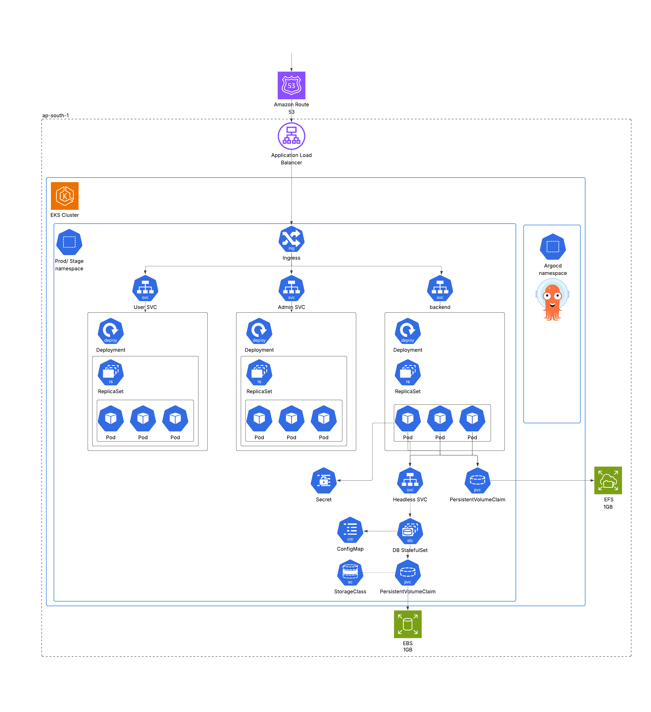

# Portfolio Infrastructure - EKS with GitOps

This repository contains the Infrastructure as Code (IaC) configuration for deploying a Portfolio Site using AWS Elastic Kubernetes Service (EKS) and following GitOps practices. The infrastructure is provisioned using Terraform, and the application delivery is managed by ArgoCD.

## 🚀 Overview

This project sets up a robust, scalable, and manageable Kubernetes environment on AWS. It leverages modern DevOps tools to ensure automated deployments and infrastructure management.

**Key Technologies:**

- **Terraform**: Infrastructure provisioning (VPC, EKS, IAM, etc.)
- **AWS EKS**: Managed Kubernetes cluster.
- **ArgoCD**: GitOps continuous delivery tool for Kubernetes.
- **AWS Load Balancer Controller**: Manages AWS Application Load Balancers for Ingress.
- **GitHub Actions**: CI/CD pipeline for Terraform automation.

## 🏗️ Architecture

The infrastructure is designed for high availability and security within the `ap-south-1` region.

### Infrastructure Diagram

This diagram illustrates the AWS resources provisioning, including the VPC, EKS Control Plane, Worker Nodes, and integration with Route 53 and Load Balancers.


### Resource & Deployment Map

This diagram shows the Kubernetes resources, including Deployments, Services, Ingress, and the ArgoCD integration.



## 🛠️ Prerequisites

Before you begin, ensure you have the following tools installed and configured:

- **[AWS CLI](https://docs.aws.amazon.com/cli/latest/userguide/getting-started-install.html)**: To interact with AWS services.
- **[Terraform](https://developer.hashicorp.com/terraform/install)** (v1.7+): To provision infrastructure.
- **[Kubectl](https://kubernetes.io/docs/tasks/tools/)**: To interact with the Kubernetes cluster.
- **AWS Account**: With appropriate permissions to create EKS clusters, VPCs, and IAM roles.

## 📂 Project Structure

```
├── .github/workflows   # GitHub Actions workflows for CI/CD
├── assets/             # Architecture diagrams and images
├── argocd.tf           # ArgoCD Helm release configuration
├── aws-lbc.tf          # AWS Load Balancer Controller configuration
├── certificate_and_route53/ # SSL Certificate and Route53 configuration
├── efs.tf              # EFS file system configuration
├── eks.tf              # EKS Cluster definition
├── providers.tf        # Terraform AWS & Kubernetes providers
├── variables.tf        # Input variables
├── vpc.tf              # VPC network configuration
└── README.md           # Project documentation
```

## ⚙️ Configuration Details

### VPC

- **CIDR**: `10.0.0.0/16`
- **Subnets**: Public and Private subnets across 3 Availability Zones.
- **NAT Gateway**: Single NAT Gateway for outbound connectivity from private subnets.

### EKS Cluster

- **Version**: Kubernetes 1.33
- **Node Groups**: `t3.large` instances with auto-scaling
- **Add-ons**:
  - `vpc-cni`
  - `coredns`
  - `kube-proxy`
  - `aws-ebs-csi-driver` (for EBS volumes)
  - `aws-efs-csi-driver` (for EFS storage)

### GitOps & Ingress

- **ArgoCD**: Installed via Helm chart (Version 9.0.0) in the `argocd` namespace.
- **AWS Load Balancer Controller**: Manages ALBs for Ingress resources, enabling external access to services.

## 🚀 Setup & Deployment

### 1. Clone the Repository

```bash
git clone https://github.com/KavinduGD/portfolio-infra.git
cd portfolio-infra
```

### 2. Configure AWS Credentials

Ensure your environment is configured with AWS credentials:

```bash
aws configure
```

### 3. Initialize Terraform

Initialize the Terraform working directory. This will download the necessary providers and modules.

```bash
terraform init
```

### 4. Plan the Infrastructure

Preview the changes that Terraform will make.

```bash
terraform plan
```

### 5. Apply Configuration

Apply the changes to provision the infrastructure.

```bash
terraform apply --auto-approve
```

### 6. Configure Kubectl

Update your kubeconfig to interact with the new cluster:

```bash
aws eks update-kubeconfig --region ap-south-1 --name <your-cluster-name>
```

## 🔄 CI/CD Pipeline

The project includes a GitHub Actions workflow (`.github/workflows/main.yaml`) that automates the Terraform deployment process.

- **Trigger**: Pull requests to `main` branche.
- **Process**:
  1.  **Checkout Code**: Pulls the latest code.
  2.  **Configure AWS**: Sets up AWS credentials from GitHub Secrets.
  3.  **Terraform Init**: Initializes Terraform.
  4.  **Terraform Validate**: Checks for syntax errors.
  5.  **Terraform Plan**: Generates an execution plan.
  6.  **Terraform Apply**: Applies the changes automatically on merge.
